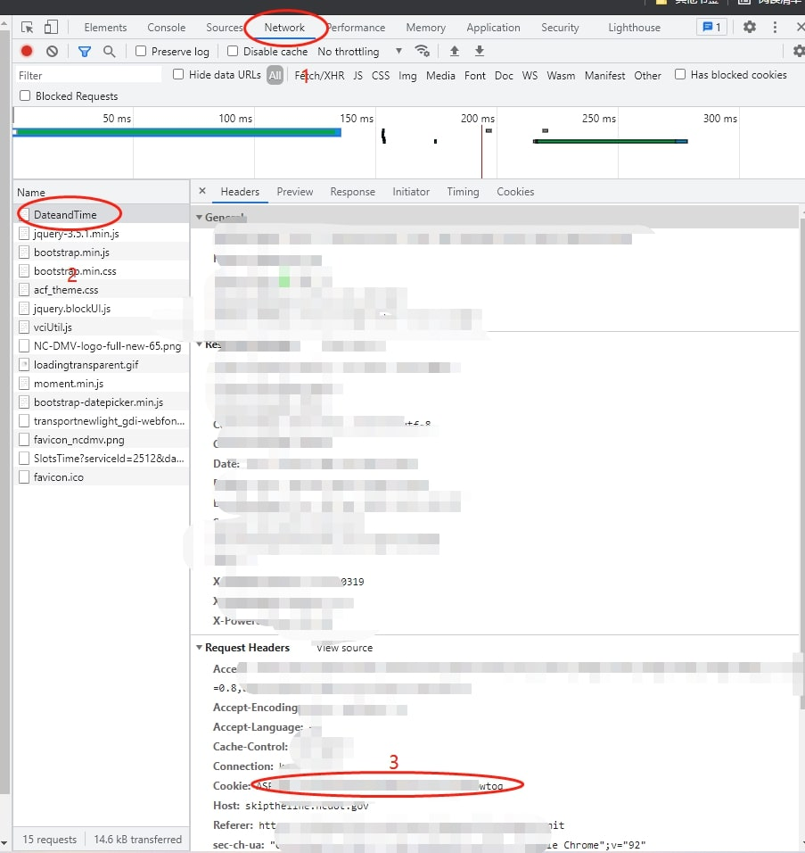

# driver_permit_detector

脚本可以实现刷permit和刷road test的功能，并在刷到时发邮件提醒。
新版更新会在cookie失效时发邮件提醒换cookie

### sender email configuration

代码中需要修改 "quickstart.py" 文件中 mail_user, mail_pass, sender，receivers  四个变量实现发邮件提醒功能

mail_user，mail_pass和sender为发送邮箱的信息，具体方式参考下面链接
please refer to [使用python给自己邮箱发邮件](https://blog.csdn.net/weixin_40475396/article/details/78693408)

receivers 为接收邮箱的信息，即你想要收到提醒的邮箱，可以多个。注意，最好不要用谷歌邮箱接收，实测会崩溃。

### cookie configuration

代码需要修改 cities_list 变量的值，来实现地点选择。想抢几个地点就搞几个cookie（推荐只放一个）
The detector rely on the the correctness of cookie, which means you need to copy the cookie from your browser. You can do it in the following instructions.

* go to [DMV](https://skiptheline.ncdot.gov/Webapp/) and click your favourate location. 到上述网页选择你想刷的地点和类型（类型指路考或permit，其它也行）。
* enter "F12". refresh the webpage and click "DateandTime" section. 其实就是chrome浏览器->更多工具->开发者工具->network 中找到 DateandTime并刷新。参考图片。
* copy the cookie from the header to your python file. 将cookie复制到cities_list，比如将'a cookie'换成真正的cookie。

### 免费咨询和有偿代刷

脚本使用上的问题可以提issue，我看到会及时回复。

完全不会python 或者 不想用自己电脑刷的朋友也可以联系作者有偿代刷。

### 各位老板觉得好用的话可以给我打赏

